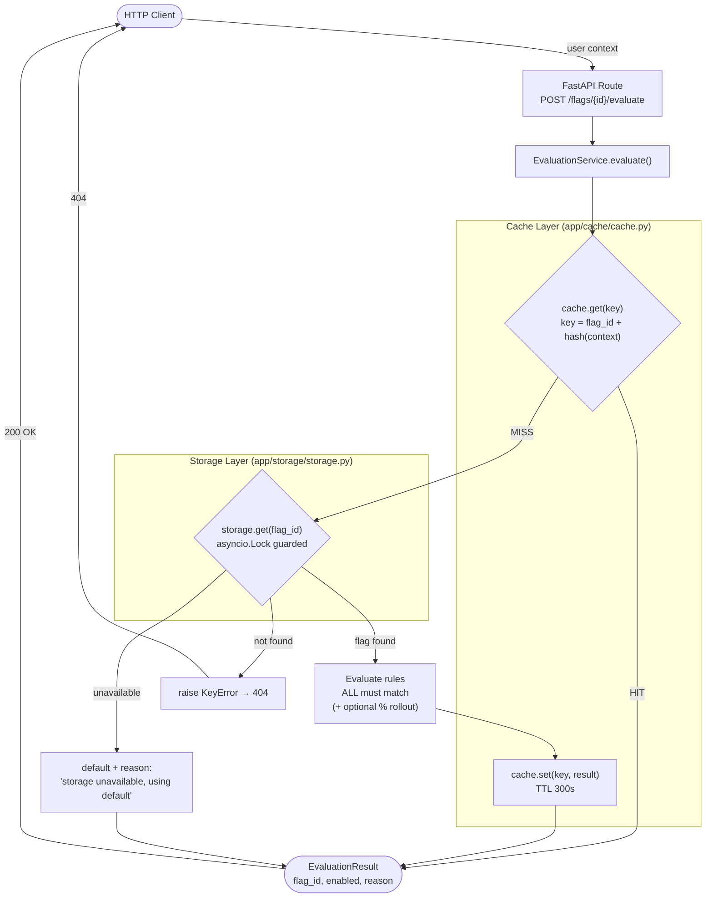

# Feature Flag API

A small, production-shaped **feature flag** service built with **FastAPI**. Flags
are evaluated against a user context using ordered rules (all of which must
match), with an optional **percentage rollout**. Evaluation results are cached
in-memory with a TTL, and the cache is invalidated whenever a flag changes.

## Features

- REST API for creating, listing, fetching, deleting, and evaluating flags.
- Rule engine with `equals`, `not_equals`, `in`, `not_in` operators over
  `user_id`, `subscription_tier`, and `region`.
- **ALL rules must match** for a flag to be ON. A missing context field fails
  that rule.
- In-memory **TTL cache** (default 300s) keyed by `flag_id` + a hash of the user
  context, with hit/miss tracking surfaced via `/health`.
- **Graceful fallback**: if storage is unavailable, evaluation returns a safe
  default with a clear reason instead of erroring.
- Thread-safe storage guarded by an `asyncio.Lock`.
- Strictly-typed **pydantic** models and **pydantic-settings** config.
- Structured **JSON logging** on every operation.
- Optional **percentage rollout** (`hash(user_id) % 100 < percentage`).

## Architecture

The diagram below traces the full lifecycle of a
`POST /flags/{flag_id}/evaluate` request through the API, cache, storage, and
rule-evaluation layers.



Cache writes are skipped on the fallback and not-found paths; the cache is also
invalidated (`cache.invalidate(flag_id)`) whenever a flag is updated or deleted.

## Project layout

```
app/
  main.py                      # FastAPI app + endpoints
  config.py                    # pydantic-settings config (.env)
  models.py                    # Flag, Rule, Evaluation models + enums
  logging_config.py            # JSON structured logging
  cache/cache.py               # TTL cache with hit/miss + invalidation
  storage/storage.py           # asyncio.Lock-guarded in-memory store
  services/evaluation_service.py  # cache -> storage -> rules -> cache
tests/                         # pytest unit + API tests
.github/workflows/ci.yml       # GitHub Actions: install deps + pytest
```

## Setup

```bash
python -m venv .venv
source .venv/bin/activate
pip install -r requirements.txt
cp .env.example .env   # optional; sensible defaults are built in
```

## Run

```bash
uvicorn app.main:app --reload --host 0.0.0.0 --port 8000
```

Interactive docs are then available at <http://localhost:8000/docs>.

## Run the tests

```bash
pytest -q
```

## Configuration

Configuration is read from environment variables or a local `.env` file
(see `.env.example`):

| Variable             | Default            | Description                          |
| -------------------- | ------------------ | ------------------------------------ |
| `APP_NAME`           | `Feature Flag API` | Service name shown in docs/logs.     |
| `LOG_LEVEL`          | `INFO`             | Logging level.                       |
| `CACHE_TTL_SECONDS`  | `300`              | Evaluation cache TTL in seconds.     |
| `HOST`               | `0.0.0.0`          | Bind host (for your own run script). |
| `PORT`               | `8000`             | Bind port.                           |

## API

| Method   | Path                        | Success | Notes                                   |
| -------- | --------------------------- | ------- | --------------------------------------- |
| `POST`   | `/flags`                    | `201`   | Create a flag. `409` on duplicate name. |
| `GET`    | `/flags`                    | `200`   | List all flags.                         |
| `GET`    | `/flags/{flag_id}`          | `200`   | `404` if not found.                     |
| `PATCH`  | `/flags/{flag_id}`          | `200`   | Partial update. `404` if not found. `409` on name conflict. Invalidates cache immediately. |
| `DELETE` | `/flags/{flag_id}`          | `204`   | Invalidates cache. `404` if not found.  |
| `POST`   | `/flags/{flag_id}/evaluate` | `200`   | Evaluate for a user context.            |
| `GET`    | `/health`                   | `200`   | Status, total flags, cache hit rate.    |

Invalid request bodies return `422` (pydantic validation).

## Example payloads

### Create a flag with rules

```bash
curl -X POST http://localhost:8000/flags \
  -H 'Content-Type: application/json' \
  -d '{
    "name": "checkout-v2",
    "default_state": false,
    "rules": [
      {"field": "subscription_tier", "operator": "equals", "value": "premium"},
      {"field": "region", "operator": "in", "value": ["us", "ca"]}
    ]
  }'
```

### Create a flag with a percentage rollout

```bash
curl -X POST http://localhost:8000/flags \
  -H 'Content-Type: application/json' \
  -d '{
    "name": "beta-banner",
    "default_state": true,
    "rules": [],
    "percentage": 25
  }'
```

### Update a flag (partial)

Only the fields you send are changed; the rest are left untouched. Updating a
flag invalidates its cached evaluations immediately.

Update a flag's default state:

```bash
curl -X PATCH http://localhost:8000/flags/<FLAG_ID> \
  -H 'Content-Type: application/json' \
  -d '{"default_state": true}'
```

Update rules only:

```bash
curl -X PATCH http://localhost:8000/flags/<FLAG_ID> \
  -H 'Content-Type: application/json' \
  -d '{"rules": [{"field": "region", "operator": "equals", "value": "us"}]}'
```

Clear the percentage rollout (send an explicit `null`):

```bash
curl -X PATCH http://localhost:8000/flags/<FLAG_ID> \
  -H 'Content-Type: application/json' \
  -d '{"percentage": null}'
```

### Evaluate a flag

```bash
curl -X POST http://localhost:8000/flags/<FLAG_ID>/evaluate \
  -H 'Content-Type: application/json' \
  -d '{
    "user_id": "user-123",
    "subscription_tier": "premium",
    "region": "us"
  }'
```

Example response:

```json
{
  "flag_id": "f9a1...",
  "enabled": true,
  "reason": "all rules matched"
}
```

Other example reasons:

- `"no rules defined, using default"` — flag has no rules.
- `"rule 0 failed: subscription_tier equals 'premium' (actual='free')"`
- `"storage unavailable, using default"` — graceful fallback.
- `"all rules matched; percentage rollout 25% (bucket=12, included)"`

### Health

```bash
curl http://localhost:8000/health
```

```json
{
  "status": "ok",
  "total_flags": 2,
  "cache": {"hits": 10, "misses": 4, "hit_rate": 0.7143, "size": 6}
}
```

## Evaluation semantics

1. Look up the cache (`flag_id` + hashed user context). Return on hit.
2. Load the flag from storage. If storage is down, return the safe default with
   reason `"storage unavailable, using default"`.
3. No rules → return `default_state` with reason `"no rules defined, using default"`.
4. Evaluate every rule; **all** must match. A missing context field fails the rule.
5. If a `percentage` is set, an otherwise-ON result is gated on
   `hash(user_id) % 100 < percentage` (stable SHA-256 hash).
6. Cache the result and return it.

A flag's cached evaluations are invalidated immediately whenever the flag is
**updated (`PATCH`)** or **deleted (`DELETE`)**, so stale results are never
served after a change.
